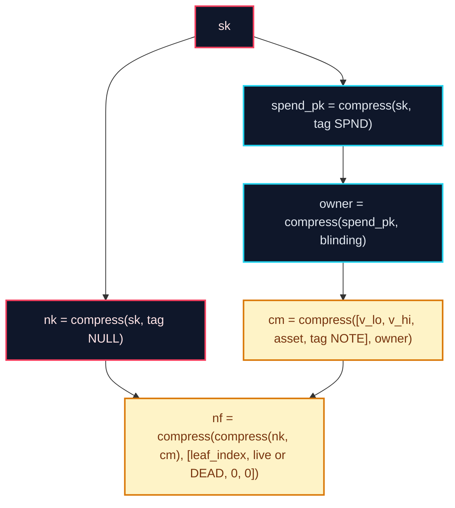
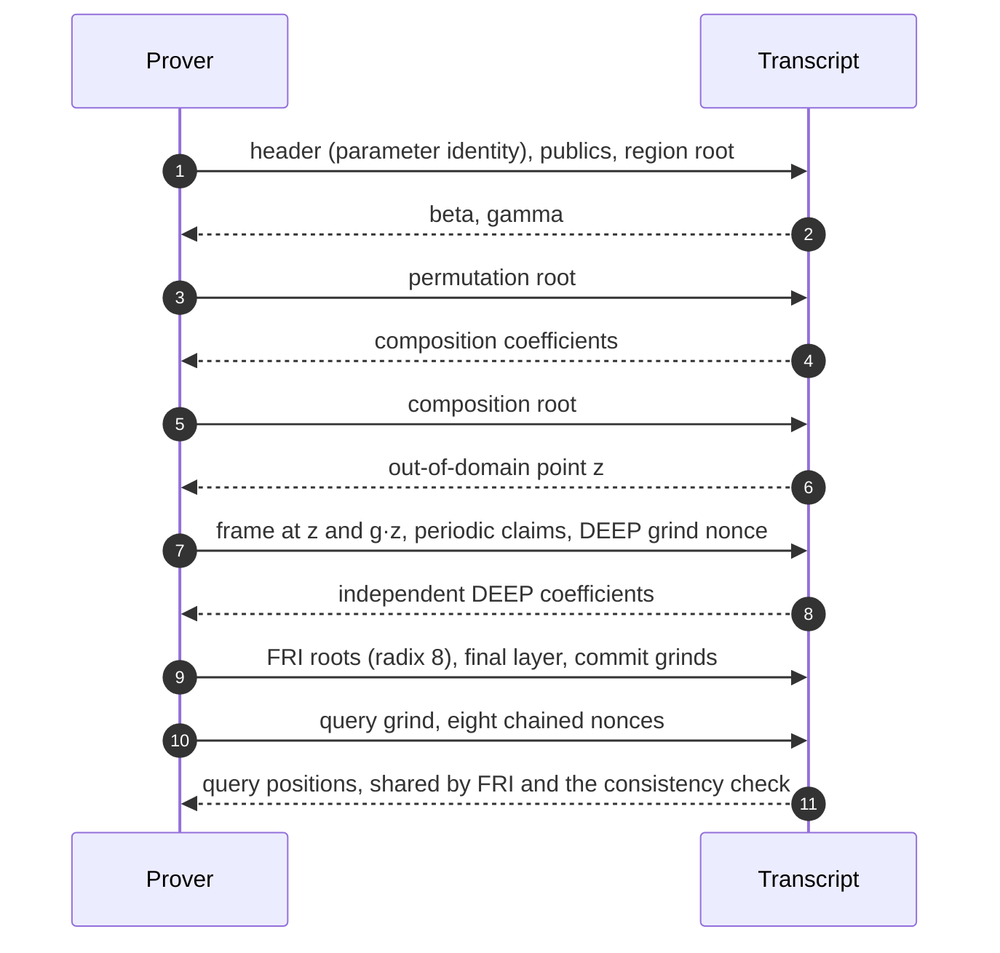

<div align="center">

# NØNOS Shield · STARK

**The proof system behind private payments on Ethereum, and the circuits it proves: a
transparent STARK over one 64-bit field, verified directly on chain.**

No trusted setup · No elliptic curves in the proof system · One field · Machine-checked core

</div>

> [!WARNING]
> **Testnet, pre-audit.** The pool and its verifier run on the Sepolia test network. Nothing here
> has had an external audit. Do not put value you cannot lose behind it.

<br/>

| | |
|---|---|
| **Field** | Goldilocks, p = 2^64 − 2^32 + 1, with F_p² = F_p[X]/(X² − 7) for every challenge |
| **Hash in the circuit** | Poseidon, width 8, rate 4, x^7, Cauchy MDS |
| **Commitments** | Keccak-256 Merkle trees, 32-byte digests |
| **Argument** | AIR over a two-row window, DEEP-FRI at radix 8, a two-round commitment for the copy constraint |
| **Proof format** | format 7: one shared set of query paths, the parameter set's identity in a 40-byte header |
| **On chain** | each payment's proof verified in Solidity by a compiled program image of its circuit |
| **Notes to the payee** | sealed with X-Wing (ML-KEM-768 + X25519) and ChaCha20-Poly1305: post-quantum note privacy |
| **Checked by** | Rust test suites with tamper tests and a cell-by-cell coverage audit, and a Lean core with no admitted proof |

## Contents

1. [What is proven](#what-is-proven)
2. [Deployed](#deployed)
3. [Soundness](#soundness)
4. [Tutorials](#tutorials)
5. [Repository](#repository)
6. [Security](#security)

---

## What is proven

Every statement is a circuit with its own public words, its own compiled program image and its own
pinned proofs in `spec/`. A verifier holds the image, the periodic root and the accepted parameter
identities, and refuses everything else before it reads a proof.

| statement | public words | what it says | where it is verified |
|---|---:|---|---|
| **transfer** | 36 | two notes spent and two created, values balanced, fee paid, nullifiers derived from the spender's key | the pool `0xD0dB…d541` |
| **transfer with not-before** | 37 | the transfer, settled no earlier than a stated time on a 600-second grid | the production pool `0xaEe5…e1cb` |
| **claim** | 38 | the transfer, with the two input notes' value sums made public | a claim verifier in the contracts repository, not yet deployed |
| **attestation** | 9 | a context digest of a given kind is a slot of a 256-slot policy tree | the NØNOS kernel's boot and spawn gates, and [verify.nonos.software](https://verify.nonos.software) |
| **activity** | 18 | one key spent k (1 to 4) different notes in a week, with a weekly tag, a payout and a key commitment | the rewards contracts, not yet deployed |

### Notes, keys and nullifiers

Everything is built from one compression, `compress(l, r)`: the rate lanes after permuting
`[l | r]`. A domain tag is `tag(v) = [v, 0, 0, 0]`.



- **The leaf index is in the nullifier.** Two identical notes commit identically, and the position
  keeps their nullifiers apart. A dummy input writes a dead marker beside its position, so its
  nullifier never equals a live note's.
- **Every payment has two inputs and two outputs,** with dummies filling the shape, so a one-note
  payment looks like a two-note payment.
- **Notes live in an append-only Merkle tree;** the pool records spent nullifiers and refuses a
  second use.

### The copy constraint takes two rounds

Cells that must be equal are tied by a grand product over `(value + β·id + γ)`. That argues
nothing if the prover knows β and γ before building the trace, so the region columns are committed
first, β and γ are drawn from the transcript against that root, and only then are the permutation
columns built and committed.



The full order of every absorb, draw and grind is in [docs/17-transcript.md](docs/17-transcript.md).

## Deployed

Sepolia test network. Every address below was read from the chain.

| contract | address |
|---|---|
| production pool (37-word transfers) | `0xaEe51E82965Ec1DeD870F3f4c248Ad4AdDc3e1cb` |
| its verifier | `0xDA9dD4A3e957AFD2179131273C93dabBA1186A44` |
| amount policy | `0x660f66ab31Ca9919D9e1770FEDc88Ff2dd29CE59` |
| fee router | `0x0Be77d3cF5Dd8989254e1f75B5D520f483603f6D` |
| association registry | `0xF6B5c3470eb7F1bdE3412E72Eff4235A4536a206` |
| root bounty | `0x0DBdEA16938d8c7efd54fBf5CEFE20EF31FA4cAd` |
| link registry | `0xf1DC54d83b21D416ce619fA8C2E29C8381594225` |
| NOX (test token) | `0x3E5249A65CA513D5e11260222e0D26f46b465d36` |
| test faucet | `0x871bc3AD5DA20c399d631817637cB5FB29eB04B4` |
| owner of the pool (Safe) | `0xD4251BA8bD4F68690BaB9f27d544819cFBE11854` |
| pool for 36-word transfers | `0xD0dBCe195c082DA39a218C62c01a732CE5b4d541` |

### What each verifier pins

| | transfer | transfer with not-before | claim | attestation | activity |
|---|---|---|---|---|---|
| image hash | `0x72f4ccfc…2765` | `0x4364151e…2429` | `0x2c417abf…5ee5` | `0x4a0c6d79…8d93` | `0x3dc8e36e…b12c` |
| program hash | `0xfbf04c7e…1677` | `0x5f9aa987…a965` | `0x86780401…eded` | `0xa74b431b…08c1` | `0xd9156056…60fd` |
| periodic root | `0x898b800f…2888` | the same | `0x572ce7aa…42b5` | `0xaeb47d73…55fb` | `0xbce7b94b…5d48` |

The full values, every accepted parameter identity and every pinned proof's keccak256 are in each
statement's `spec/<statement>/MANIFEST.md`. `nox_verify/src/statements.rs` holds the same values
and refuses a proof made under any other.

## Soundness

A STARK's soundness is stated two ways, and both are published for every point:

```math
\text{conjectured} = q \cdot \log_2(1/\rho) + \gamma, \qquad \text{provable} = \left\lfloor \frac{q \cdot \log_2(1/\rho)}{2} \right\rfloor + \gamma
```

where q is the number of queries, ρ the rate and γ the grinding bits. The first assumes the FRI
proximity conjecture; the second stays inside the proven list-decoding radius. Measured round by
round, the weakest round bounds the whole proof, so the commit and DEEP rounds carry grinds of their
own.

| point | queries | rate | query grind | query phase | provable, round by round |
|---|---:|---|---:|---:|---:|
| A, the wallet's default | 19 | 2^-6 | 28 | 80.8 bits | 80.1 bits |
| A′ | 18 | 2^-6 | 31 | | the smaller of its query phase and 80.1 ([docs/16](docs/16-grind-handoff.md)) |
| B | 17 | 2^-6 | 33 | | the smaller of its query phase and 80.1 ([docs/16](docs/16-grind-handoff.md)) |
| attestation | 26 | 2^-6 | 28 | about 100 bits | 80 bits under the 2020 theorem |

The DEEP batching challenge takes independent coefficients after a 19-bit grind, and each FRI
fold a 21-bit grind, so no round falls below the query phase. Every figure is checked in
`lean/Shield` (`RoundByRound`, `Gaps2025`, `Masking`, `Outsourced`). [docs/12-soundness.md](docs/12-soundness.md)
carries the arithmetic, and [docs/12-zero-knowledge.md](docs/12-zero-knowledge.md) the
zero-knowledge argument and its per-proof rank certificate.

"Post-quantum" in this repository means one thing: the privacy of the notes sealed to a payee.

## Tutorials

You need Rust (the toolchain is pinned in `rust-toolchain.toml`), Python 3, and for the browser
module Node 22. The Zig client needs Zig 0.14.0. The Lean core needs [elan](https://github.com/leanprover/elan).

The builds:

| feature | what it builds |
|---|---|
| `parallel` | uses every core (rayon); add it to every build below except wasm |
| `fri8` | the deployed transcript: radix 8, 32-byte digests, exact draws, the DEEP grind, format 7 |
| `not_before` | the 37-word transfer (implies `fri8`) |
| `claim` | the 38-word claim (implies `fri8`) |

### 1. Build and run the suites

```sh
cargo build --release --workspace --features parallel

cargo test --release -p nonos-stark --features parallel
cargo test --release -p stark_proofs --features "parallel fri8" --lib
cargo test --release -p stark_proofs --features "parallel not_before" --lib
cargo test --release -p stark_proofs --features "parallel claim" --lib
```

Each circuit's suite proves honest statements, refuses tampered ones with the circuit alone, and
audits every cell of a satisfying witness: a cell no constraint reads must be named by a rule, and
the counts are pinned.

### 2. Verify a pinned proof

```sh
cargo test --release -p nox_verify
```

This verifies every proof under `spec/` through its statement's compiled program image, and checks
that each is refused with a public word moved or a byte flipped. `nox_verify` is `no_std` and is
what a gate links:

```rust
use nox_verify::{statements::NOT_BEFORE, verify};

let proof: &[u8] = /* format 7 bytes */;
let words: &[u64] = /* the statement's public words */;
verify(&NOT_BEFORE, proof, words)?; // Ok(()) or a Refusal saying why
```

### 3. Verify in a browser

```sh
rustup target add wasm32-unknown-unknown
cargo build --profile wallet -p nox_verify_wasm --target wasm32-unknown-unknown
node nox_verify_wasm/js/check.mjs target/wasm32-unknown-unknown/wallet/nox_verify_wasm.wasm spec
```

`nox_verify_wasm/js/nox-verify.mjs` is the page's interface (`load`, `verify`, `attestWords`,
`leaf`, `foldTree`, `blake3`). Public words go in as `BigInt`: a JSON number keeps 53 bits and a
word runs to 64, so read them with `wordsFromJson`.

### 4. Prove a payment the way a wallet does

```sh
cargo run --release -p nox_prover --features "parallel not_before" --bin nox_bench -- \
  spec/wallet-vectors-not-before/transfer-eth/request.json \
  spec/wallet-vectors-not-before/transfer-eth/seed.json proof.json
```

The request and seed formats are in [nox_prover/REQUEST.md](nox_prover/REQUEST.md). Apps link the
same code through the C interface in `nox_prover/include/nox_prover.h`: `nox_prove_ex` reports
progress phase by phase and can be cancelled, and `nox_activity_prove` proves a weekly activity
claim. The vectors under `spec/wallet-vectors-*` are what a wallet build must reproduce byte for
byte from fixed entropy.

### 5. Reproduce a release build

```sh
git archive <commit> | tar -x -C src && cd src
RUSTFLAGS="--remap-path-prefix=$PWD=/src --remap-path-prefix=$HOME/.cargo=/cargo --remap-path-prefix=$HOME/.rustup=/rustup" \
  cargo build --profile wallet -p nox_verify_wasm --target wasm32-unknown-unknown
sha256sum target/wasm32-unknown-unknown/wallet/nox_verify_wasm.wasm
```

Built twice from two directories, the module and the prover libraries come out identical.

### 6. Re-derive a program image

The image a verifier pins is compiled from the circuit, never typed. `emit_activity` (and each
statement's emitter) writes a proof's per-query encoding, `proof.f5`, beside `proof.bin`; the
oracle and the tape are read from it:

```sh
cargo run --release -p stark_proofs --features "parallel fri8" --bin emit_activity -- out
cargo run --release -p stark_proofs --features "parallel fri8" --bin emit_program_oracle -- \
  out/k1/proof.f5 oracle.json activity q=19 grind=28 extra=5
cargo run --release -p stark_proofs --features "parallel fri8" --bin emit_transition_tape -- \
  transition-tape.json activity=out/k1/proof.f5.publics.json oracle.json
```

The tape is accepted only if replaying it reproduces every transition the oracle recorded. The
contracts repository encodes it into the program and image whose hashes are in the tables above.

### 7. Run the Zig client

```sh
cd ocean && zig build test --summary all
```

Zig 0.14.0. The client rebuilds every pinned wallet vector from its own keys, trees, nullifiers
and commitments and must land on the words the Rust prover proved; the activity test folds the
week's leaves to its root and derives T and K. `python3 ci/vector_agree.py --root .` checks that
the client and the circuit still agree on the key hierarchy and the intent's layout.

### 8. Check the Lean core

```sh
cd lean && lake build
```

No Mathlib, no `sorry`, no axiom beyond Lean's own. Tests in `stark_proofs` read the models'
constants and tables out of the `.lean` files and hold them equal to the circuits, so neither side
can move alone.

## Repository

| path | what it is |
|---|---|
| `nonos-stark/` | the engine: Goldilocks and F_p², NTT and LDE, DEEP-FRI, Merkle over Keccak and Poseidon, the AIR traits, provers and verifiers |
| `stark_proofs/` | the circuits: notes, keys, join-split, nullifiers, attestation, activity; their audits, tamper tests and emitters in `src/bin` |
| `nox_prover/` | what a wallet links: the prover behind a C, wasm and Rust interface, with progress and cancellation |
| `nox_verify/` | the `no_std` verifier that reads a statement's program image; what a gate links |
| `nox_verify_wasm/` | the same verifier as a browser module, with its JavaScript interface |
| `note_seal/` | sealing a note's opening to its payee (X-Wing) |
| `ocean/` | the reference client in Zig: keys, notes, the tree mirror, sealed notes, the 36 and 37 word intents, the activity tag and key commitment; pinned to the same vectors |
| `lean/` | the machine-checked core |
| `spec/` | each statement's program, pinned proofs and manifest, and the wallet vectors |
| `docs/` | the field, Poseidon, keys and notes, trees, soundness, zero knowledge, the transcript, verification |
| `fuzz/` | fuzzing the verifier's parsers and checks |

Read next: [docs/03-keys-notes-nullifiers.md](docs/03-keys-notes-nullifiers.md) for keys, notes
and nullifiers, [docs/12-soundness.md](docs/12-soundness.md) for the soundness argument,
[docs/verify.md](docs/verify.md) for verifying a proof, [PARAMS.md](PARAMS.md) for every constant,
and [THREAT.md](THREAT.md) for what is defended.

## Security

Report a vulnerability privately through this repository's **Security** tab ("Report a
vulnerability"), not in a public issue.

## License

AGPL-3.0-or-later.
