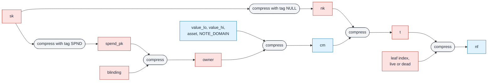
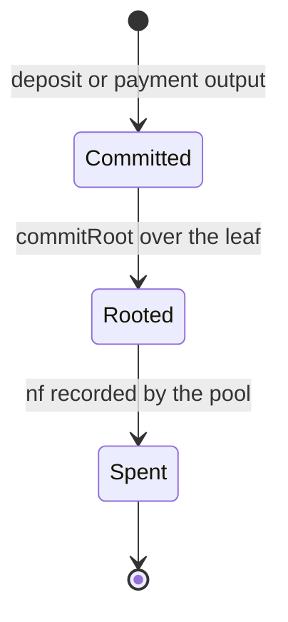

# 03. Keys, notes and nullifiers

A shielded payment spends notes it owns and creates notes for its payees. This document defines
the objects that make that possible: the spending secret and the two keys derived from it, the
note and its commitment, the value representation that makes conservation an integer statement,
and the nullifier that retires a note once and only once. For each object it gives the definition the
circuit enforces, the reason each input is there, and the byte encoding at every boundary where
the object leaves a program.

Hash notation is that of [02-poseidon.md](02-poseidon.md): $\mathrm{compress}(\ell, r)$ for
$`\ell, r \in \mathbb{F}_p^4`$ is the rate half of the 32-round permutation applied to
$`\ell \,\|\, r`$, and $\mathrm{tag}(v) = (v, 0, 0, 0)$. A *digest* is an element of
$`\mathbb{F}_p^4`$, written $`(d_0, d_1, d_2, d_3)`$ with $`d_0`$ the low limb.

Code references are to `stark_proofs/src/shield/` unless another path is given.
A wallet computes the same functions and is checked against the same vector
(Section 8).

## 1. Overview



Red boxes stay with the owner. Blue boxes appear on chain: the commitment when the note is
created, the nullifier when it is spent. Six compressions connect them, and the circuit proves
every one of them together with the wiring between them.

## 2. Keys

**Definition 2.1 (spending secret).** A spending secret is a digest
$`\mathit{sk} \in \mathbb{F}_p^4`$.

The client derives it from a 32-byte seed $s$. Limb $i$ is the first value
$`x = \mathrm{le64}\big(\mathrm{BLAKE3}(\texttt{"NOX-SHIELD-SPEND-KEY"} \,\|\, s \,\|\, i \,\|\, c)[0..8]\big)`$,
over a one-byte counter $c = 0, 1, \dots$, that satisfies $x < p$ (
`Secret.fromSeed`). Rejection sampling makes each limb uniform on $`\mathbb{F}_p`$ when BLAKE3 is
modelled as a random oracle. A limb is rejected with probability $(2^{64} - p)/2^{64} < 2^{-32}$,
so the counter almost never passes zero.

**Definition 2.2 (keys).** With the domain constants of Table 1,

```math
\mathit{spend\_pk} = \mathrm{compress}(\mathit{sk}, \mathrm{tag}(\mathtt{SPEND\_DOMAIN})), \qquad \mathit{nk} = \mathrm{compress}(\mathit{sk}, \mathrm{tag}(\mathtt{NULL\_DOMAIN}))
```

(`key/derive.rs:15`, `derive`).

| constant | value | ASCII | defined at |
|---|---|---|---|
| `SPEND_DOMAIN` | `0x5350_4E44` | SPND | `key/domain.rs:9` |
| `NULL_DOMAIN` | `0x4E55_4C4C` | NULL | `key/domain.rs:10` |
| `DEAD_DOMAIN` | `0x4445_4144` | DEAD | `key/domain.rs:21` |
| `NOTE_DOMAIN` | `0x4E4F_5445` | NOTE | `nonos-stark/src/air/poseidon.rs:39` |

*Table 1. Domain constants. Each is a 32-bit ASCII word, so each is a canonical field element.*

$`\mathit{spend\_pk}`$ goes into every note the owner can spend. $\mathit{nk}$ never leaves the
owner and keys the nullifier. Both descend from one secret, and the circuit proves both
derivations from the same witnessed $\mathit{sk}$ in one region (`key/parts.rs:160`,
four depth-one openings of a `MultiMembership`).

The reason for the single root is a double spend. If the nullifier key were an independent
secret, one commitment could be retired under a nullifier per key, and anyone who learned a
commitment could pick a key of their own and retire a note they do not own. The tests
`test/foreign_key.rs` (`a_second_key_cannot_retire_the_note`) and `test/not_owner.rs`
(`a_secret_cannot_spend_a_note_it_does_not_key`) break each tie in turn and check that the
wired circuit refuses.

**Domain words are constants in the circuit.** Each compression absorbs its right operand into a
witness cell. A prover free to choose the absorbed word of the second compression would derive a
different $\mathit{nk}$ down a chain that closes just as well, and so a second nullifier for the
same note. The circuit pins lane 0 of each domain word by a boundary constraint and ties the
three zero lanes of both domain words, together with lanes 2 and 3 of the position word of
Section 5, into one wiring class anchored to zero by a third boundary (`key/parts.rs:86`,
`domain_boundary`, and `key/edges.rs:33`, `domain_zero_cells`). The test
`test/nullifier_domain.rs` (`a_nullifier_key_derived_under_another_word_is_refused`) moves only
that word.

## 3. Notes and commitments

**Definition 3.1 (note).** A note is a tuple
$`(v, a, \mathit{spend\_pk}, b)`$ with value $v \in [0, 2^{64})$, asset identifier
$a \in [0, 2^{64})$, owner key $`\mathit{spend\_pk} \in \mathbb{F}_p^4`$ and blinding
$`b \in \mathbb{F}_p^4`$ (`note/limbs.rs:10`).

Its eleven limbs are $`(v_{lo}, v_{hi}, a, \mathit{spend\_pk}_0, \dots, \mathit{spend\_pk}_3, b_0, \dots, b_3)`$ with

```math
v_{lo} = v \bmod 2^{32}, \qquad v_{hi} = \lfloor v / 2^{32} \rfloor
```

(`note/limbs.rs:20`, `Note::limbs`, `NOTE_LIMBS = 11` at
`nonos-stark/src/air/poseidon.rs:34`).

**Definition 3.2 (commitment).** With the public quad
$`q = (v_{lo}, v_{hi}, a, \mathtt{NOTE\_DOMAIN})`$,

```math
\mathit{owner} = \mathrm{compress}(\mathit{spend\_pk}, b), \qquad \mathit{cm} = \mathrm{compress}(q, \mathit{owner})
```

(`note/limbs.rs:36`, `quads`, and `note/parts.rs:33`, `note_parts_broken`).

The nesting follows the deposit. A depositor sends the pool the owner digest and the funds, and
the pool computes the outer compression itself from the value it took into custody
(`ShieldedPool.sol`, `absorb` and `_computeCommitmentWith`). The pool never sees the key or the
blinding, and a depositor cannot commit to a value other than the amount it paid. No operand of
either compression mixes a public limb with a secret one, so the pool's half of the hash is a
function of public data alone.

The circuit proves the two compressions as two depth-one openings and wires the first one's
output, lane by lane, into the right operand of the second (`note/edges.rs:24`, `note_edges`).
Binding one lane would leave three free. The test `test/note_edge.rs` breaks the chain while
keeping each compression honest, and `test/pool_hash.rs`
(`the_commitment_nests_the_owner_under_the_public_quad`) checks the nesting against the pool's
definition.

**Proposition 3.3 (binding).** A prover who opens one commitment to two different notes finds a
collision of $\mathrm{compress}$.

*Proof.* Suppose $\mathit{cm} = \mathrm{compress}(q, \mathit{owner}) = \mathrm{compress}(q', \mathit{owner}')$
for two notes. If $(q, \mathit{owner}) \ne (q', \mathit{owner}')$ this is a collision. Otherwise
$q = q'$ fixes $`v_{lo}, v_{hi}, a`$, and so $v$ because the limb split is injective on
$[0, 2^{64})$, and $\mathit{owner} = \mathit{owner}'$ with
$`(\mathit{spend\_pk}, b) \ne (\mathit{spend\_pk}', b')`$ is a collision of the inner compression.
$\square$

**Proposition 3.4 (hiding).** Model the permutation as a random permutation and let the blinding
be uniform on $`\mathbb{F}_p^4`$. An adversary making $Q$ permutation queries distinguishes the
commitments of two notes with equal public limbs only if one of its queries has
$`(\mathit{spend\_pk}, b)`$ as its input, an event of probability at most $Q / p^4$ per note.

*Proof sketch.* Until that event occurs the adversary has not evaluated the permutation at the
input that defines $\mathit{owner}$, so $\mathit{owner}$ is the truncated output of a random
permutation at an unqueried point, independent of the note's secret half, and $\mathit{cm}$ is
a function of $\mathit{owner}$ and public data. The blinding alone carries
$`4 \log_2 p \approx 256`$ bits of min-entropy. This is a sketch in the random permutation model,
and the model is an assumption about Poseidon. $\square$

The client draws each blinding limb by rejection sampling from its random source
(a uniform draw from the operating system's entropy), so every
limb is uniform on $`\mathbb{F}_p`$.

## 4. Values

Section 4 is its own file, [03-values.md](03-values.md): the 32-bit split, the balance and range
regions, integer conservation, and dummy inputs.

## 5. Nullifiers

**Definition 5.1 (position word).** For a leaf index $i$ and a liveness bit,

```math
\mathrm{pos}(i, \text{live}) = (i,\ 0,\ 0,\ 0), \qquad \mathrm{pos}(i, \text{dead}) = (i,\ \mathtt{DEAD\_DOMAIN},\ 0,\ 0)
```

(`key/domain.rs:31`, `position_word`).

**Definition 5.2 (nullifier).**

```math
t = \mathrm{compress}(\mathit{nk}, \mathit{cm}), \qquad \mathit{nf} = \mathrm{compress}(t, \mathrm{pos}(i, \cdot))
```

(`key/derive.rs:28`, `nullifier`). The pool records each nullifier it sees in
`mapping(bytes32 => bool) nullifierSpent` and refuses a second use (`ShieldedPool.sol`,
`NullifierAlreadySpent`).

Each input has a reason.

**The nullifier key.** $\mathit{nf}$ is computable only by the holder of $\mathit{nk}$. An observer
who knows $\mathit{cm}$ cannot compute the nullifier and so cannot link a spend to the deposit
that created the note. As with hiding, this rests on modelling $\mathrm{compress}$ as a
pseudorandom function keyed by its secret operand. The circuit wires $\mathit{nk}$ from the same
$\mathit{sk}$ that derived the note's $`\mathit{spend\_pk}`$ (`join/bind_key.rs:18`), so only the
owner can produce a nullifier the circuit accepts.

**The commitment.** $\mathit{cm}$ is wired to the commitment the membership proof authenticated
(`join/bind_key.rs:28`). Without the wire a prover spends one note and retires another.

**The leaf index.** Two notes with equal fields have equal commitments, and nothing stops a
depositor from making two such deposits. Without the index their nullifiers would be equal, and
spending one would lock the other forever. With it they differ.

**Proposition 5.3.** For a fixed note, distinct leaf indices give distinct nullifiers unless
$\mathrm{compress}$ has a collision. For a fixed leaf index, the nullifier is a function of the
note and $\mathit{nk}$.

*Proof.* The second claim is the definition. For the first, the position words
$\mathrm{pos}(i, \cdot)$ and $\mathrm{pos}(i', \cdot)$ differ in lane 0 for $i \ne i'$, both are
canonical because $i < 2^{32} < p$ in a tree of depth 32, and equal outputs of the second
compression on different inputs are a collision. $\square$

The index in the nullifier must also be the index the membership proof walked. A prover who
keeps the note, the key and the membership honest and moves only the scalar would retire one note
under two indices, which is a double spend. The circuit recovers the scalar from the membership
path's direction bits and wires the result into the cell the fourth compression absorbs
(`join/bind_index.rs:16`, `index_classes`). Bit 0, the leaf's own left or right, gets its own
wire because the higher directions leave it free. The tests `test/double_spend.rs`
(`a_note_cannot_be_retired_under_a_foreign_index`, with `Break::ForeignIndex` and
`Break::ForeignIndex0` at `key/parts.rs:29` and `key/parts.rs:53`) break each binding
separately.

**The dead lane.** The pool retires both nullifiers of every payment, because no public word says
which input was a dummy and a word that did would publish how many notes each payment spent. A
dummy's nullifier must land where no note's can. Lane 1 of its position word is
$`\mathtt{DEAD\_DOMAIN}`$ where a note's is zero, and the live gate forces the lane from the bit:

```math
\delta + \lambda\,\mathtt{DEAD\_DOMAIN} - \mathtt{DEAD\_DOMAIN} = 0
```

(`live_gate/air.rs:113`), with the lane cell $\delta$ wired from the key region into the gate
(`join/bind_publics.rs:73`). For $\lambda = 1$ this gives $\delta = 0$, for $\lambda = 0$ it gives
$`\delta = \mathtt{DEAD\_DOMAIN}`$.

**Proposition 5.4.** A dummy's nullifier equals a live note's nullifier only through a collision
of $\mathrm{compress}$.

*Proof.* The two final compressions absorb position words that differ in lane 1. $\square$

`test/nullifier_domain.rs` checks both directions: `a_dummy_cannot_hash_its_nullifier_as_a_note_does`
and `the_same_dummy_with_its_own_lane_is_accepted`. The client makes each dummy a fresh note of
value zero with a fresh blinding, so its commitment, and so its
nullifier, is new each time and a burned dummy never blocks a later payment.

## 6. The note life cycle



A commitment is appended to the note tree when the pool accepts it
([04-trees.md](04-trees.md)). It becomes spendable when a root that contains it is committed,
because the circuit proves membership against a published root. It is spent when its nullifier is
recorded. The leaf stays in the tree forever, and nothing on chain links the leaf to the
nullifier.

## 7. Byte encodings and canonicality

**Digest.** A digest is carried as a `bytes32` holding the big-endian 256-bit integer
$`\sum_{k} d_k\, 2^{64k}`$: bytes 0 to 7 are limb 3 and bytes 24 to 31 are limb 0, each big-endian
The prover's outputs use the same order
(`key/derive.rs:48`, the test helper `limbs`, and the sealing step of the relay that packs a
leaf as limb 3 first). The pool's commitment preimage `pub` word packs
$`v_{lo} + 2^{64} v_{hi} + 2^{128} a + 2^{192}\,\mathtt{NOTE\_DOMAIN}`$, which is the public quad in
the same order (`ShieldedPool.sol`, `_computeCommitmentWith`).

**Note.** The client serialises a note as 80 bytes: value (8), asset (8), $`\mathit{spend\_pk}`$
(32) and blinding (32), integers big-endian and digests as above.

**Canonicality.** A field element has one encoding, the integer in $[0, p)$. Every boundary where
bytes become field elements refuses the others:

| boundary | rule | code |
|---|---|---|
| pool, deposit | owner digest canonical, amount at most `MAX_VALUE` | `ShieldedPool.sol`, `absorb` |
| pool, public words | every limb and scalar word $< p$ | `PublicWords.sol`, `NonCanonicalLimb` |

The Rust constructor `Fp::from_u64` reduces a value $x \ge p$ to $x - p$
(`nonos-stark/src/field/element.rs:30`). It is used on values that are already canonical or
range-limited, such as limbs below $2^{32}$ and domain constants, and it is not a parsing
boundary.

A non-canonical encoding would matter in two places. Two byte strings for one nullifier would
let one note be recorded as spent under two keys of `nullifierSpent`. Two encodings of one
public word would let a proof verify against calldata that means something else. Both are
closed by the pool's checks above.

## 8. Vectors and tests

The file `spec/shield-key-hierarchy.json` holds three cases, each with
$\mathit{sk}$, $`\mathit{spend\_pk}`$, $\mathit{nk}$, value, asset, blinding, $\mathit{owner}$,
$\mathit{cm}$, leaf index, $\mathit{nf}$ and the dead nullifier. The values are $1{,}000$,
$5{,}000{,}000$ and $2^{32} - 1$, the last one at the edge of the low limb. Three programs check
them:

| side | test |
|---|---|
| Rust, emitter | `stark_proofs/src/bin/emit_key_vector.rs` writes the file |
| Rust, circuit | `test/key_vector.rs`, `the_circuit_derives_the_published_vector` |
| Solidity pool | the constructor self-test compares the pool's commitment with the vector |

`key/derive.rs:69` (`the_live_note_derives_from_its_secret`) pins a note that exists on the test
network.

The refusal tests for this document, each of which breaks one binding and checks that the wired
circuit refuses: `test/mints.rs`, `test/burns.rs`, `test/cross_asset.rs`,
`test/double_spend.rs`, `test/foreign_key.rs`, `test/not_owner.rs`, `test/owns.rs`,
`test/note_edge.rs`, `test/nullifier_domain.rs`, `test/one_note.rs` and `value_wrap_test.rs`.

## 9. Open items

- **Amount bound in the client.** The circuit proves values up to $p - 2$ (Corollary 4.4,
  [03-values.md](03-values.md)). A wallet's balance check refuses a
  sum above $2^{64} - 1$ but does not refuse a single output in $[p - 1, 2^{64})$. Such a note
  cannot be spent, and the prover refuses the payment that creates it, so the failure is a
  refused payment, not a loss of funds.
- **Amount bound at deposit.** A deposit whose net value exceeds $p - 2$ creates a commitment no
  proof can spend. The pool's bound is `Goldilocks.MAX_VALUE`, and it must be at most $p - 2$.
- **Per-asset conservation.** [Section 4.5](03-values.md) covers a single-asset transfer. A
  swap needs conservation per asset.
- **Hiding and unlinkability** rest on modelling Poseidon as a random permutation (Proposition
  3.4 and Section 5). The security margin of the permutation is in
  [02-poseidon.md](02-poseidon.md).
